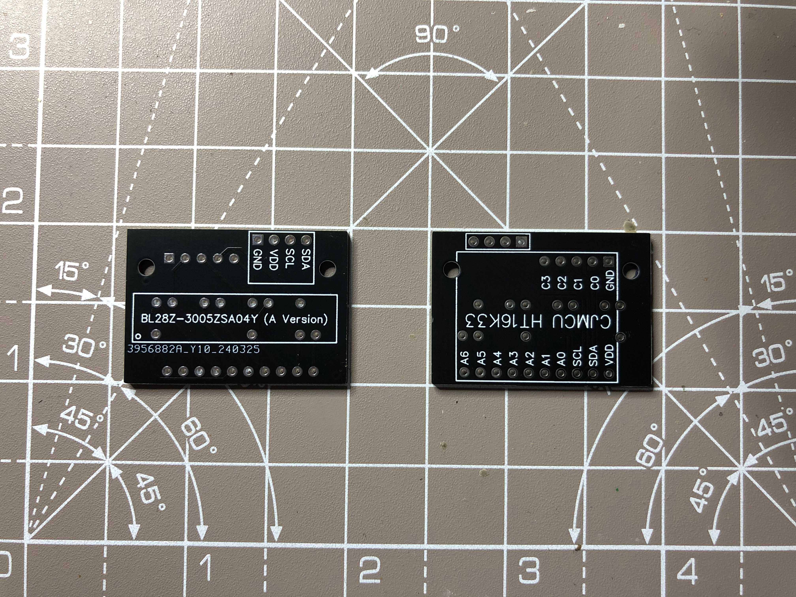
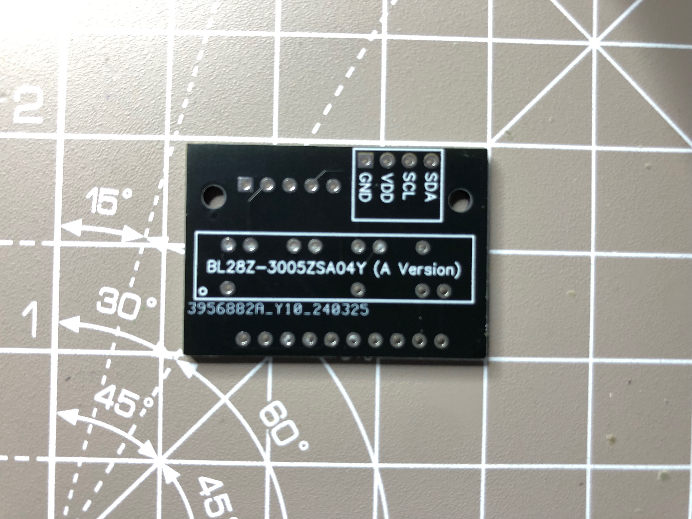

# PCBs Directory

This directory contains all the files necessary for the manufacture of printed circuit boards (PCBs) that accompany the project(s) in this repository.

## Directory Structure

- MikeS11_Designs: These are the Pack and Wand PCBs that Mike Simone designed for his code.

- rbalboa8_Designs: These are my PCB designs.

- **BargraphToDriverBoardPCB/**:
  - **BL28Z-3005ZSA04Y (A Version) Bargraph Version/**:
    - **Image**: An example image of the specific Bargraph
    - **EasyEDA_Files/**: The design files which you can use to edit the board if required
    - **GerberFiles/**: Contains Gerber files required for PCB manufacturing.
    - **Layouts/**: Contains PCB layout files for each project.
    - **Schematics/**: Contains schematic files for each project.

  - **BL28Z-3005ZSK04Y (K Version) Bargraph Version/**:
    - **Image**: An example image of the specific Bargraph
    - **EasyEDA_Files/**: The design files which you can use to edit the board if required
    - **GerberFiles/**: Contains Gerber files required for PCB manufacturing.
    - **Layouts/**: Contains PCB layout files for each project.
    - **Required_Code_Changes/**: Images detailing the required changes to the library code to make this variant work correctly
    - **Schematics/**: Contains schematic files for each project.

## Projects Overview

### rbalboa8_Designs:

### BargraphToDriverBoardPCB:

A simple PCB to connect the bargraph LED Matrix to the HT16K33 driver board. The boar has the following features:

- Makes soldering quicker and easier.
- Saves space. The inside of the Wand has limited void to fit all the electronic and moving parts.
- Has screw points to attach the bargraph without glue. This makes repairs easier
- The board is designed to use headers on the driver side. Meaning this can replaced without desoldering.
- There are two variants of the bargraph 'Common Anode' (code default) and 'Common Cathode'. There is a specific board version for each bargraph versions

### BL28Z-3005ZSA04Y (A Version) Bargraph Version

- This is the recommended version and will only work with the Common Anode version of the bargraph, BL28Z-3005ZSA04Y. No code change is required to make this version work with the MikeS11 code.

  
  
  

### BL28Z-3005ZSK04Y (K Version) Bargraph Version

- This is the board for the variant of the bargraph that some people have mistakenly purchased and will only work with the Common Cathode version of the bargraph, BL28Z-3005ZSK04Y. A code change is required to make this version work with the MikeS11 code. It is fairly simple to do and you can find details of what to do in the **Required_Code_Changes/** directory accompanying the files.

## How to Use These Files

### Viewing and Editing Schematics

1. **Open Schematic Files**:
   - Use the EasyEDA tool to open `.json` files.
   - View `.png` file using any PDF viewer for a quick overview.

2. **Edit Schematics**:
   - Open the `.json` files in KiCad to make modifications
   - View `Schematics/.png` file using any PDF viewer for a quick overview.

### Viewing and Editing PCB Layouts

1. **Open Layout Files**:
   - Use use EasyEDA tool to open `.json` files.

2. **Edit Layouts**:
   - Open the `.kicad_pcb` files in KiCad to make modifications.
  - View the `Layouts/.png` file using any PDF viewer for a quick overview.

### Manufacturing PCBs

1. **Gerber Files**:
   - Use the ZIP archive in the `gerbers` directory to send to a PCB manufacturer.
   - Alternatively, upload the individual Gerber files to the manufacturer's website.

2. **Verify Gerbers**:
   - Use a Gerber viewer to verify the files before submission.

## Contribution Guidelines

1. **Updating Files**:
   - Ensure any changes to schematics, layouts, or Gerbers are documented in the respective project's changelog.

2. **Versioning**:
   - Follow semantic versioning when making significant changes to the PCB designs.

## Additional Resources

- [EasyEDA Documentation](https://docs.easyeda.com/en/FAQ/Editor/index.html)
- [Gerber File Format](https://en.wikipedia.org/wiki/Gerber_format)
- [PCB Manufacturing Guide]
